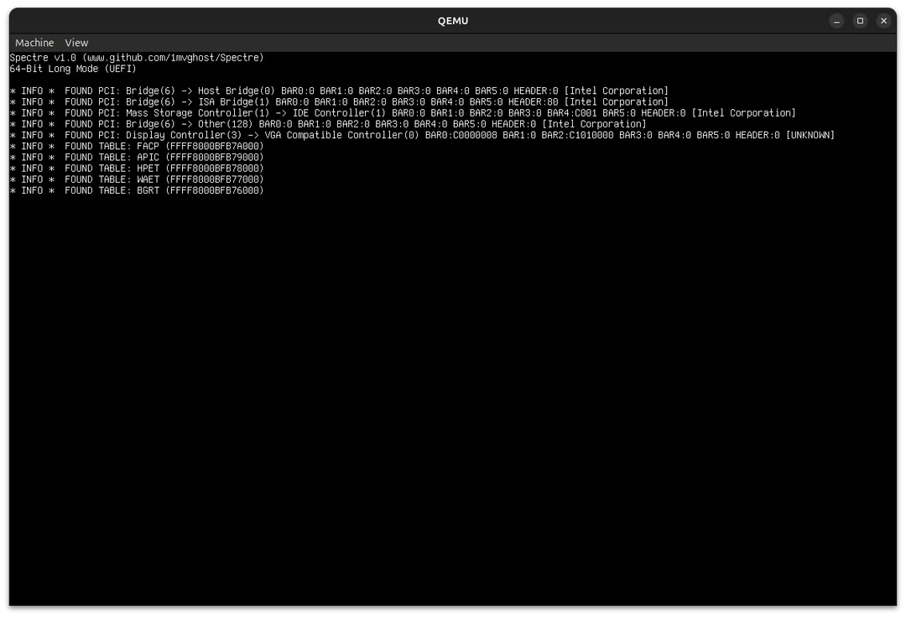

# spctrx
spctrx is a 64-Bit Hobby Kernel made in C. It uses [Limine Bootloader](https://github.com/limine-bootloader/limine) for booting.
</br>

 
</br>



# * features *
* AHCI & IDE Disk Drivers <br/>
* ACPI <br/>
* PMM <br/>
* Heap Allocator <br/>
* VFS <br/>
* SMP </br>

# * upcoming *
* User Mode <br/>
* Multitasking <br/>
* ..and much more</br>

# * compiling *
(there is really no need to compile, the release is usually in the "Releases" tab)

1. Clone the repository
```bash
git clone https://github.com/1mvghost/spctrx.git
```
2. Install some stuff you may need and make (make sure you're at the root!)
```bash
./tools/install.sh
make all
```
3. If everything goes right, you now have the ISO which you can use to boot the OS :)

# * booting *
- real hardware: flash the ISO file onto an USB stick (with dd, Rufus etc) and use your BIOS's Boot Menu to boot from the USB
- QEMU/Bochs: you can use the scripts found in the "tools" folder:
```bash
qemu.sh
qemuUefi.sh
bochs.sh
```
- VBox: mount the ISO as cdrom and use the Boot Menu to boot from it
